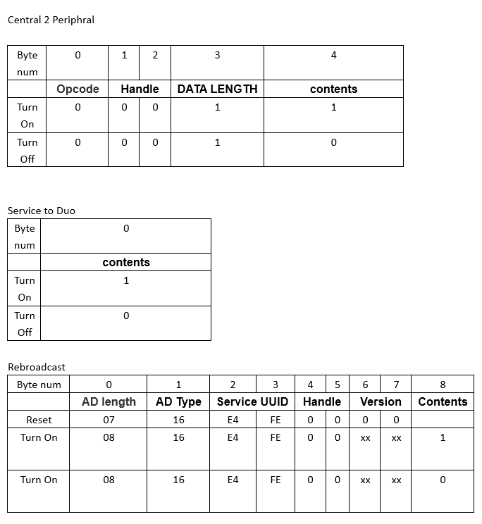

# BLE LED Mesh Protocol #

   

# How to use #

## upload the Nano firmware ##

1. update the nano softdevice to `s110_nrf51_8.0.0_softdevice.hex` with nRFgo studio
2. update the Nano user application to `rbc_gateway_example.hex`(in `nano firmware` folder)
3. or you can upload the [BLE Gateway](https://github.com/NordicSemiconductor/nRF51-ble-bcast-mesh/tree/master/nRF51/examples/BLE_Gateway) example .(need to change the LED_START in base on your board)
4. use BLE APP such as LightBlue to connect and send data to nano

## upload the Duo firmware ##
1. upload the `Duo_keil_led_mesh` sketch by Arduino IDE
2. use nodejs tools to send data to Duo.
